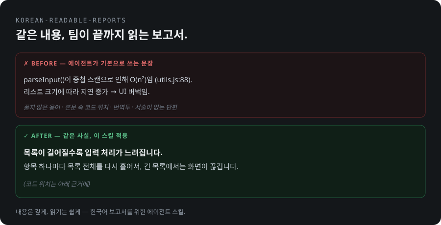

# korean-readable-reports

**AI 에이전트가 쓴 보고서를 팀이 실제로 읽게 만드는 스킬입니다.**
[SummerRiversound/human-readable-reports](https://github.com/SummerRiversound/human-readable-reports)를 바탕으로, 한국어 보고서에 맞게 개량했습니다.

  



---

## 무엇을 고치나

에이전트 보고서는 기본값이 장황함입니다.
전문 용어가 풀이 없이 나오고, 본문 중간에 `file:line`이 박히고, 서술어 없는 단편 불릿이 이어집니다.
한국어로 쓰면 여기에 번역투("~에 의해 반환됩니다")와 업무 관용투("해당 건 진행 부탁드립니다")가 더해집니다.
내용은 깊게 두고, 읽기만 쉽게 만드는 것이 이 스킬의 목표입니다.

> **Before** — 에이전트가 기본으로 쓰는 문장
> ```
> parseInput()이 중첩 스캔으로 인해 O(n²)임 (utils.js:88). 리스트 크기에 따라 지연 증가 → UI 버벅임.
> ```
>
> **After** — 같은 내용, 이 스킬 적용
> > **목록이 길어질수록 입력 처리가 느려집니다.**
> > 항목 하나마다 목록 전체를 다시 훑어서, 긴 목록에서는 화면이 끊깁니다.
> > (코드 위치는 아래 근거에)

## 규칙 15개

1. **독자 먼저** — 독자의 언어와 수준으로 쓰고, 독자를 frontmatter에 적습니다.
2. **결론 먼저** — 섹션마다 첫 문장이 요점이고, 요약 박스는 3문장 이하입니다.
3. **비유는 어려운 개념 옆에만**, 한 구절로 씁니다.
4. **온전한 문장**으로 씁니다. 단편 불릿은 쓰지 않습니다.
5. **전문 용어는 풀거나 뺍니다.** 수식과 지어낸 용어도 말로 바꿉니다.
6. **근거는 뒤로** 보냅니다. 본문에 `file:line`을 넣지 않습니다.
7. **표 칸은 구절로** 씁니다. 설명 칸은 명사구로 끝냅니다.
8. **군더더기를 뺍니다.** 요약·섹션 수·섹션 길이에 상한이 있습니다.
9. **깊은 내용은 접어 둡니다.**
10. **동료에게 설명하듯** 씁니다. 강의하듯 쓰지 않습니다.
11. **한 줄에 한 문장**입니다.
12. **HTML도 함께 냅니다.** md가 원본이고 렌더러가 HTML을 만듭니다.
13. **배경은 요청 분석**입니다. 이야기처럼 풀지 않습니다.
14. **자연스러운 한국어** — 번역투·업무 관용투를 고치고, 같은 개념은 한 단어로 씁니다.
15. **모양이 내용이면 그립니다** — 흐름, 주고받기, 구조, 핵심 수치, 나란한 항목.

전체 규칙과 체크리스트, 쓰지 않을 경우는 [`SKILL.md`](./skills/human-readable-reports/SKILL.md)에 있습니다.

## 설치

**Claude Code — 플러그인(권장).** Claude Code 안에서 두 줄을 실행합니다.

```
/plugin marketplace add dreeky-nerd/korean-readable-reports
/plugin install korean-readable-reports@dreeky-nerd
```

업데이트는 `/plugin marketplace update dreeky-nerd`로 받습니다.

**claude.ai (웹·데스크톱 앱).** [human-readable-reports.zip](https://github.com/dreeky-nerd/korean-readable-reports/releases/latest/download/human-readable-reports.zip)을 내려받아 앱의 스킬 설정에서 업로드합니다([방법](https://support.claude.com/en/articles/12512180-using-skills-in-claude)).
이 zip은 스킬이 바뀔 때마다 GitHub Actions가 자동으로 다시 만들어 [Releases](https://github.com/dreeky-nerd/korean-readable-reports/releases)에 올립니다.
렌더러와 lint는 Node 스크립트라서, HTML까지 만들려면 코드 실행이 켜져 있어야 합니다.

**Claude Code — 직접 복사.** 스킬 폴더를 개인 또는 프로젝트 스킬 폴더에 복사합니다.

```bash
git clone https://github.com/dreeky-nerd/korean-readable-reports
cp -r korean-readable-reports/skills/human-readable-reports ~/.claude/skills/          # 모든 프로젝트
cp -r korean-readable-reports/skills/human-readable-reports <project>/.claude/skills/  # 한 프로젝트
```

보고서나 분석 문서를 써 달라고 하면 에이전트가 알아서 이 스킬을 불러옵니다.
스킬 이름은 원작과 같은 `human-readable-reports`입니다.

## 구성

| 경로 | 내용 |
|---|---|
| `skills/human-readable-reports/SKILL.md` | 에이전트가 따르는 규칙·작업 순서·체크리스트 |
| `…/scripts/render.js` | md를 HTML 한 장으로 렌더(라이트·다크, 목차, Mermaid, 전용 블록), lint도 함께 실행 |
| `…/scripts/lint.js` | 기계로 검사할 수 있는 규칙 검사 |
| `…/references/template.html` | 렌더러가 채우는 페이지 디자인 |
| `…/references/examples.md` | 실패 유형별 고치기 전후 예시 12쌍, 독자별로 같은 내용을 다르게 쓰는 예 |
| `…/references/design-guide.md` | 색, 차트 선택, Mermaid 주의점, 검증 기록 |
| `…/references/ko-terms.md` | 한국어 용어·표현 기준 — 한국어 API 문서 249건(한국어 원문 221 · 번역판 28)을 비교해 정함 |
| `.claude-plugin/marketplace.json` | 이 저장소를 Claude Code 플러그인 마켓플레이스로 만드는 파일 |
| `tools/package.js` | SKILL.md frontmatter를 검사한 뒤 claude.ai 업로드용 zip을 `dist/`에 만듦(`node tools/package.js`) |
| `.github/workflows/package.yml` | main에 스킬이 바뀌면 zip을 만들어 Releases의 `latest`에 올림 |

렌더러가 아는 전용 md 블록입니다(자세한 문법은 `scripts/render.js` 맨 위).

- ` ```flow ` — 가지 없는 순서를 카드와 곡선 화살표로, 역할별 색.
- ` ```stats ` — 핵심 수치 2~4개를 카드로, 상태는 색 띠와 글자 배지.
- ` ```cards ` — 나란한 항목을 카드로, 글 길이에 따라 배치가 바뀌고 `[추천]`은 강조.
- ` ```mermaid ` — Mermaid 다이어그램, 페이지의 라이트·다크 색에 맞춤.

## 스크립트 (의존성 없음, Node 18+)

경로는 스킬 폴더 기준이고, 어디서 실행해도 됩니다.

```bash
node scripts/lint.js report.md            # 규칙 검사 + 필수 frontmatter + 렌더가 조용히 바꾸는 입력
node scripts/render.js report.md          # md → report.html, lint도 실행
node scripts/render.js report.md --strict # 경고가 있으면 exit 1 (CI·pre-commit). 힌트는 실패로 안 침
```

## 쓰지 않을 때

에이전트가 단계별로 **실행할 스펙이나 계획서**에는 쓰지 않습니다.
그때는 쉬운 말보다 정확함이 먼저라서 `file:line`, 시그니처, 코드를 본문에 그대로 둡니다.
이 스킬은 사람이 읽는 보고서용입니다.

## 원작과 라이선스

- 원작: [SummerRiversound/human-readable-reports](https://github.com/SummerRiversound/human-readable-reports) — 규칙 10개와 고치기 전후 예시의 바탕.
- 한국어 개량: [dreeky-nerd](https://github.com/dreeky-nerd) — 한국어 보고서용 규칙(배경은 요청 분석, 자연스러운 한국어, 그릴지 판단), 한국어 용어 기준, 렌더러 디자인과 전용 블록, lint 확장.
- MIT 라이선스 — [`LICENSE`](./LICENSE)에 원작자와 개량자 저작권 표시가 함께 있습니다.
